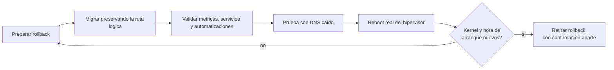

# Hypervisor as Control Plane

> Un hipervisor domestico operado como plataforma: limites claros, evidencia y rollback.

Este repositorio documenta, de forma sanitizada, el diseno y la operacion de la
capa de virtualizacion de un homelab personal: un hipervisor tratado como
control plane, la organizacion del storage de maquinas virtuales y un caso real
de migracion de storage con reboot controlado.

Es parte de un portfolio tecnico pensado para entrevistas de trabajo. No es
documentacion operativa de un entorno en produccion: es una version
transformada -decisiones, patrones y aprendizajes- de un homelab real, sin
datos que permitan identificarlo o reproducirlo.

Lo que busca demostrar: criterio de arquitectura para tratar un hipervisor
domestico como una pieza critica de infraestructura, capacidad de ejecutar
cambios sensibles (migraciones de storage, reboots) con evidencia y rollback, y
honestidad tecnica sobre los riesgos residuales que quedan abiertos.

## En 30 segundos

| Indicador | Resultado |
|---|---|
| Migracion de storage | entorno operativo al cierre, con rollback conservado hasta la validacion funcional |
| Discos llenos causados por snapshots olvidados | **2**: desde entonces todo snapshot nace con fecha de retiro |
| Reboot del hipervisor | confirmado por hora de arranque y kernel activo, no por un corte de SSH |
| Maquinas que no arrancaron solas tras un reboot real | **2**, aunque la configuracion decia que si |
| Prueba con el DNS primario apagado | ejecutada a proposito, antes de necesitarla |

## Indice

- [Ficha rapida para quien evalua](contexto.md)
- [Arquitectura de virtualizacion](docs/01-arquitectura-virtualizacion.md)
- [Caso de estudio: migracion de storage y reboot controlado](docs/casos-de-estudio/01-migracion-storage-y-reboot-controlado.md)

## Parte de una serie

Este repo es una pieza de un proyecto mas grande: un **homelab personal**
operado como infraestructura real y documentado en cinco repos
independientes. Cada uno se lee solo; juntos muestran el entorno completo.

- [Zero Trust Remote Access](https://github.com/Nicolasperaltait/zero-trust-remote-access)
- [Backups That Don't Lie](https://github.com/Nicolasperaltait/backups-that-dont-lie)
- [Alerts That Matter](https://github.com/Nicolasperaltait/alerts-that-matter)
- [Network Segmentation Playbook](https://github.com/Nicolasperaltait/network-segmentation-playbook)
- [Hypervisor as Control Plane](https://github.com/Nicolasperaltait/hypervisor-as-control-plane) (este repo)

## Licencia

Ver [LICENSE.md](LICENSE.md).
