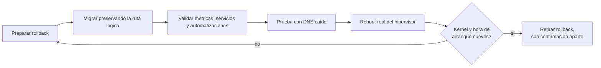
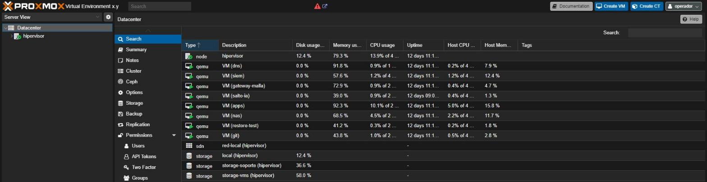
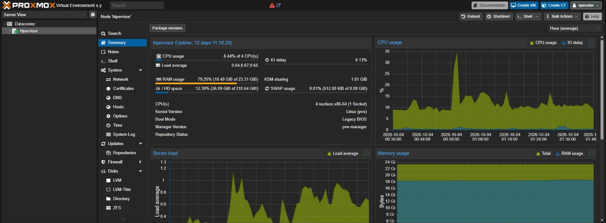
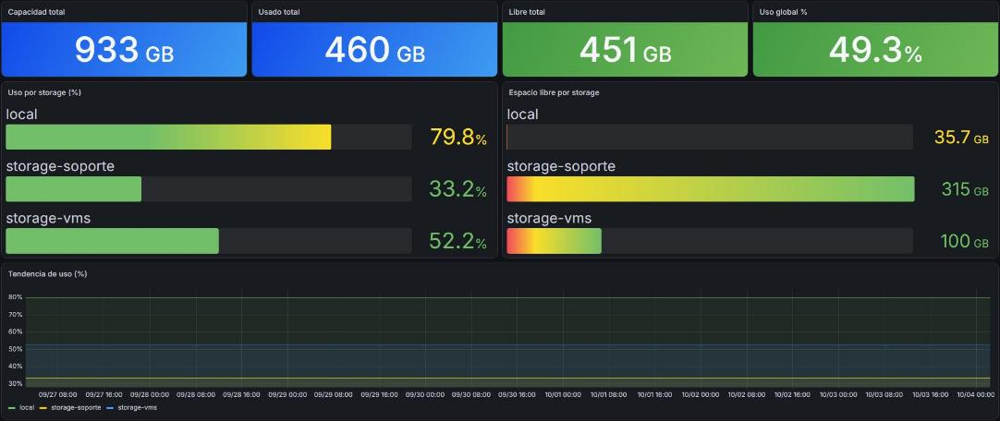

# Hypervisor as Control Plane

> Un hipervisor de tipo 1, encendido 24/7, operado como plataforma productiva: limites claros, evidencia y rollback.

Este repositorio documenta, de forma sanitizada, el diseno y la operacion de la
capa de virtualizacion de una infraestructura productiva personal (homelab): un hipervisor tratado como
control plane, la organizacion del storage de maquinas virtuales y un caso real
de migracion de storage con reboot controlado.

Es parte de un portfolio tecnico. **No es un laboratorio de prueba: es
infraestructura productiva.** No tiene la escala de una empresa, pero tiene
todas sus piezas -virtualizacion, red segmentada, DNS, almacenamiento, backups
con copia externa, monitoreo, SIEM, acceso remoto y aplicaciones en uso- y
funciona 24/7 sobre un hipervisor de tipo 1 (Proxmox VE) en un servidor dedicado. Cuando
algo falla, el impacto es real.

La documentacion operativa es privada. Esto es su version transformada
-decisiones, patrones y aprendizajes-, sin datos que permitan identificar o
reproducir el entorno.

Lo que busca demostrar: criterio de arquitectura para tratar un hipervisor personal como
infraestructura productiva critica, capacidad de ejecutar
cambios sensibles (migraciones de storage, reboots) con evidencia y rollback, y
honestidad tecnica sobre los riesgos residuales que quedan abiertos.

## Escala chica, exigencia de produccion

| Pieza | Con que | Si falla |
|---|---|---|
| Virtualizacion | Proxmox VE, hipervisor de tipo 1; una maquina por funcion | cae todo lo demas |
| DNS interno | Pi-hole, resolucion para todos los equipos y servicios | todo parece caido aunque este sano |
| Red y acceso remoto | zonas por funcion; Tailscale sin puertos abiertos, politica por puerto | se pierde el aislamiento o el acceso desde afuera |
| Almacenamiento y backups | OpenMediaVault, backups nocturnos, copia cifrada externa, pruebas de restauracion | se pierde la capacidad de recuperar |
| Monitoreo y seguridad | Prometheus, Grafana, Wazuh y alertas al telefono | los incidentes pasan sin que nadie se entere |
| Aplicaciones propias | Docker detras de Nginx Proxy Manager; una envia correo real | se frena trabajo real |
| Codigo | Forgejo privado con integracion continua | no hay donde versionar ni desde donde desplegar |

Lo mismo que en una empresa, en chico: cambios con plan y rollback, evidencia,
alertas que avisan solas y controles que se prueban haciendolos fallar.

## En 30 segundos

| Indicador | Resultado |
|---|---|
| Migracion de storage | entorno operativo al cierre, con rollback conservado hasta la validacion funcional |
| Discos llenos causados por snapshots olvidados | **2**: desde entonces todo snapshot nace con fecha de retiro |
| Reboot del hipervisor | confirmado por hora de arranque y kernel activo, no por un corte de SSH |
| Maquinas que no arrancaron solas tras un reboot real | **2**, aunque la configuracion decia que si |
| Prueba con el DNS primario apagado | ejecutada a proposito, antes de necesitarla |

## En vivo

_Capturas reales del entorno, con nombres, direcciones, usuarios y versiones reemplazados por su funcion._

Nueve maquinas, una por funcion, y storage separado por rol.

El nodo: 12 dias de uptime, carga y memoria en tiempo real.

Almacenamiento por rol: 933 GB totales, uso por storage y tendencia, sin sorpresas de espacio.

## Problema, decision, resultado

| Problema | Por que importaba | Que se hizo | Resultado |
|---|---|---|---|
| Habia que liberar storage sin romper automatizaciones, backups ni monitoreo | todo dependia de rutas y discos del hipervisor | migracion con ruta logica preservada y rollback | storage separado por rol, entorno operativo |
| Un disco lleno no se vaciaba al borrar | snapshots olvidados retenian los bloques viejos | todo snapshot nace con fecha de retiro | causa eliminada |
| La configuracion decia que todo arrancaba solo despues de un reboot | un reboot real lo desmintio para 2 maquinas | reboot real como prueba, confirmado por kernel y hora de arranque | riesgo documentado, no escondido |

El detalle de cada uno, con lo que salio mal en el camino, esta en los casos de estudio.

## Indice

- [Ficha rapida para quien evalua](contexto.md)
- [Arquitectura de virtualizacion](docs/01-arquitectura-virtualizacion.md)
- [Caso de estudio: migracion de storage y reboot controlado](docs/casos-de-estudio/01-migracion-storage-y-reboot-controlado.md)

## Parte de una serie

Este repo es una pieza de **[Homelab Prod](https://github.com/Nicolasperaltait/homelab)**:
la vista completa de una infraestructura productiva, chica en escala y completa
en piezas, encendida 24/7. Cada repo de la serie se lee solo; la portada los une.

- [Zero Trust Remote Access](https://github.com/Nicolasperaltait/zero-trust-remote-access)
- [Network Segmentation Playbook](https://github.com/Nicolasperaltait/network-segmentation-playbook)
- [Alerts That Matter](https://github.com/Nicolasperaltait/alerts-that-matter)
- [Backups That Don't Lie](https://github.com/Nicolasperaltait/backups-that-dont-lie)
- [Hypervisor as Control Plane](https://github.com/Nicolasperaltait/hypervisor-as-control-plane) (este repo)
- [SecOps Governance Blueprint](https://github.com/Nicolasperaltait/secops-governance-blueprint)

## Licencia

Ver [LICENSE.md](LICENSE.md).
