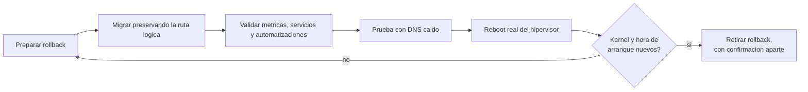

# Hypervisor as Control Plane

> Un hipervisor de tipo 1, encendido 24/7, operado como plataforma productiva: limites claros, evidencia y rollback.

Este repositorio documenta, de forma sanitizada, el diseno y la operacion de la
capa de virtualizacion de una infraestructura productiva personal (homelab): un hipervisor tratado como
control plane, la organizacion del storage de maquinas virtuales y un caso real
de migracion de storage con reboot controlado.

Es parte de un portfolio tecnico. **No es un laboratorio de prueba**: es una
**infraestructura productiva personal**. Un hipervisor de tipo 1 sobre un
servidor dedicado, encendido 24/7, del que dependen todos los dias la red de la
casa, los backups, la seguridad y aplicaciones en uso real. Si se apaga, se nota.

La documentacion operativa es privada. Esto es su version transformada
-decisiones, patrones y aprendizajes-, sin datos que permitan identificar o
reproducir el entorno.

Lo que busca demostrar: criterio de arquitectura para tratar un hipervisor personal como
infraestructura productiva critica, capacidad de ejecutar
cambios sensibles (migraciones de storage, reboots) con evidencia y rollback, y
honestidad tecnica sobre los riesgos residuales que quedan abiertos.

## Por que es infraestructura productiva

| Servicio que corre 24/7 | Que pasa si se cae |
|---|---|
| DNS de toda la red de la casa | ningun equipo resuelve nombres: para quien la usa, "se corto internet" |
| Backups nocturnos y copia cifrada fuera del sitio | se pierde la proteccion de los datos y nadie lo nota hasta necesitarla |
| SIEM, metricas y alertas al telefono | los incidentes pasan sin que nadie se entere |
| Acceso remoto por malla | no hay forma de operar desde fuera de casa |
| NAS y espejo de la estacion de trabajo | se corta la sincronizacion de los archivos de trabajo |
| Aplicaciones propias en uso diario | se frena el uso real, incluido el envio de correo |
| Remoto de codigo propio | no hay donde versionar ni desde donde desplegar |

Por eso cada cambio se trata como en produccion: plan, rollback, evidencia y
verificacion de que lo que tiene que fallar, falla.

## En 30 segundos

| Indicador | Resultado |
|---|---|
| Migracion de storage | entorno operativo al cierre, con rollback conservado hasta la validacion funcional |
| Discos llenos causados por snapshots olvidados | **2**: desde entonces todo snapshot nace con fecha de retiro |
| Reboot del hipervisor | confirmado por hora de arranque y kernel activo, no por un corte de SSH |
| Maquinas que no arrancaron solas tras un reboot real | **2**, aunque la configuracion decia que si |
| Prueba con el DNS primario apagado | ejecutada a proposito, antes de necesitarla |

## Indice

- [Ficha rapida para quien evalua](contexto.md)
- [Arquitectura de virtualizacion](docs/01-arquitectura-virtualizacion.md)
- [Caso de estudio: migracion de storage y reboot controlado](docs/casos-de-estudio/01-migracion-storage-y-reboot-controlado.md)

## Parte de una serie

Este repo es una pieza de un proyecto mas grande: una **infraestructura
productiva personal** (homelab), encendida 24/7 y documentada en cinco repos
independientes. Cada uno se lee solo; juntos muestran el entorno completo.

- [Zero Trust Remote Access](https://github.com/Nicolasperaltait/zero-trust-remote-access)
- [Backups That Don't Lie](https://github.com/Nicolasperaltait/backups-that-dont-lie)
- [Alerts That Matter](https://github.com/Nicolasperaltait/alerts-that-matter)
- [Network Segmentation Playbook](https://github.com/Nicolasperaltait/network-segmentation-playbook)
- [Hypervisor as Control Plane](https://github.com/Nicolasperaltait/hypervisor-as-control-plane) (este repo)

## Licencia

Ver [LICENSE.md](LICENSE.md).
