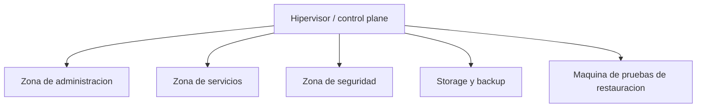

# Arquitectura de Virtualizacion

> Estado descrito: septiembre de 2026.

## Problema

Un homelab puede convertirse facilmente en una coleccion de maquinas
virtuales sin modelo operativo. Este proyecto trata el hipervisor como una
plataforma pequena de infraestructura, con limites claros, evidencia
operativa y expectativas de recuperacion, operada por una sola persona.

El problema de diseno es: como operar un hipervisor domestico realista sin
convertirlo en un entorno desordenado, sobreexpuesto o imposible de explicar.

## El hipervisor como control plane

Todo el entorno se ancla en un unico hipervisor open-source. Esa decision
tiene una consecuencia directa: el hipervisor deja de ser "solo computo" y
pasa a concentrar tres funciones a la vez:

- plataforma de virtualizacion para todas las maquinas
- punto de transito, NAT y control entre zonas de red
- ancla de la estrategia de recuperacion (snapshots, imagenes de VM)

Tratarlo asi es una decision deliberada, no un accidente: reduce la cantidad
de piezas moviles, a costa de que sus cambios sean sensibles y de que sea una
dependencia de primer orden para todo lo demas.

## Zonas funcionales

Las maquinas virtuales se organizan en zonas por funcion, todas corriendo
sobre el mismo hipervisor:

- administracion y control plane (DNS interno, NAS, puerta de acceso remoto,
  host de salto para automatizacion, remoto de codigo propio)
- servicios internos y aplicaciones propias
- monitoreo de seguridad
- storage, backup y recuperacion

## Organizacion de storage de VMs

El storage local del hipervisor se separa por rol, en vez de usar un unico
volumen para todo:

- un storage principal, reservado para los discos de las maquinas virtuales
  activas (componentes minimos y criticos)
- un storage de soporte, separado, para backups, imagenes ISO de instalacion
  y el storage que expone el NAS

Esta separacion es el resultado de una migracion real (ver el caso de
estudio de este repositorio), no un diseno de partida: al principio todo
convivia en un mismo disco, y eso generaba presion de espacio impredecible
entre backups y maquinas activas.

## Snapshots vs. backups

Una distincion que el proyecto trata como principio, no como detalle:

| Concepto | Uso correcto |
|---|---|
| Snapshot | rollback rapido antes de un cambio puntual; se crea con fecha de retiro |
| Backup / imagen de VM | recuperacion portable, pensada para restaurar en otro lugar |

Un snapshot olvidado no es inofensivo: en un disco virtual de copia en
escritura, mientras existe retiene los bloques viejos. Lo que se borra
"adentro" de la VM sigue ocupando espacio "afuera", en el storage del
hipervisor. Esto aparecio dos veces como causa real de un disco lleno (ver
el caso de estudio), y la correccion adoptada fue simple: todo snapshot nace
con una fecha de retiro.

## Arranque y dependencias

Las maquinas arrancan en orden de dependencia: primero DNS, despues la
puerta de acceso remoto y el storage, despues la plataforma de contenedores
que aloja las aplicaciones. Esto esta declarado en la configuracion de
autostart del hipervisor.

**Hallazgo real:** un reinicio real del hipervisor mostro que el arranque
escalonado se cortaba antes de llegar a las ultimas dos maquinas, aunque la
configuracion decia que debian arrancar solas. La configuracion leida sola
parecia resuelta; el reinicio mostro que no lo estaba. Quedo como riesgo
abierto hasta confirmar la causa raiz, y como leccion general: **una
configuracion no observada en un evento real (un reboot) es una hipotesis,
no un hecho verificado.**

## Dependencias de primer orden

| Componente | Motivo |
|---|---|
| Hipervisor | concentra virtualizacion, transito de red y recuperacion |
| DNS interno | si falla, muchos servicios de las VMs parecen caidos |
| Storage | impacta backups, retencion y capacidad de recuperar |
| Plataforma de contenedores | concentra aplicaciones, proxy y observabilidad |

## Riesgos residuales

| Riesgo | Por que sigue importando |
|---|---|
| Dependencia de un unico hipervisor | un solo host concentra computo, transito y recuperacion |
| Resiliencia de storage | un disco de soporte fallo y su reemplazo esta postergado |
| Cobertura de backup a nivel de imagen de VM | no todas las maquinas tienen respaldo de imagen completa, algunas solo respaldan datos |
| Arranque automatico tras reboot | dos maquinas no arrancan solas tras un reinicio real del hipervisor |

## Lectura de la arquitectura

Este proyecto se lee como registro de arquitectura y operacion de una capa
de virtualizacion pequena pero tratada con seriedad: limites y dependencias
explicitos, tradeoffs documentados, snapshots diferenciados de backups
reales, y honestidad sobre lo que un evento real (un reboot) desmintio de lo
que la configuracion prometia.
